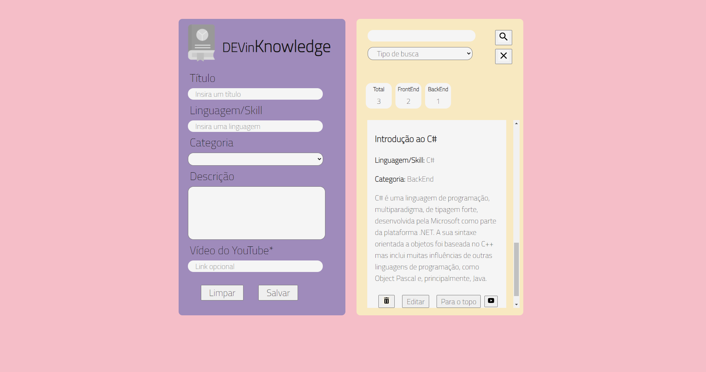

<h2>DEVinKwnoledge</h2>

 

<ul>
<li>HTML</li>
<li>CSS</li>
<li>JS</li>
</ul>

 

 Project developed during Senai's DEVinHouse course on 2022 (EDP edition). The project consists of a web page with a dynamic list of tips. 

 

    

 

 On the left side of the page there is a form to be filled in with the tip to be included on the site. In this form, you must fill in the fields of title, language, category and tip description.

There is also the option of including a link to an youtube video. Only tips with video will have a video icon with the corresponding link. 

 At the end of the tips form there is a button to save the tip and another one to delete the tip.

In the category field there is a selector including Frontend, Backend, Fullstack and Softskills options.

 

    

 

On the right side of the page there is a field to search for a tip, a dynamic panel with the amount of each tip category, and the list of tip cards.

 

    

 

The search field includes a selector where you can define whether you want to filter the list by title, language, category, description or by all these options.

Each tip card includes buttons to delete and edit the tip, as well as a button to send the tip to the top of the list.

 

    

